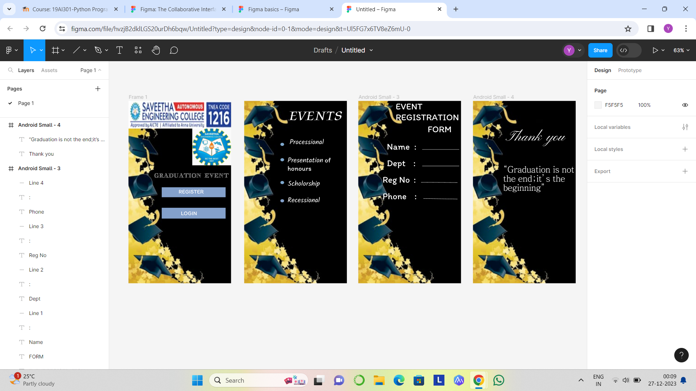

# Ex09 Event Registration Web Application
## Date:27-12-2023

## AIM:
To design, develop and deploy a web application for event registration.

## DESIGN STEPS:

### Step 1:
Create a new frame.

### Step 2:
Select any one preset size of your choice.

### Step 3:
Select the shapes you need.

### Step 4:
Import images as needed.

### Step 5:
Create pages based on your need and link them.

### Step 6:

Validate the HTML and CSS code.

### Step 6:

Publish the website in the given URL.

## DESIGN TOOL:
Figma

## CODE:
```
Home Page
<div style="width: 100%; height: 100%; position: relative; background-image: url(https://via.placeholder.com/360x640); flex-direction: column; justify-content: flex-start; align-items: flex-start; display: inline-flex">
    
    
    <div style="width: 281px; height: 44px; color: white; font-size: 20px; font-family: Jacques Francois Shadow; font-weight: 400; word-wrap: break-word">GRADUATION  EVENT</div>
    <div style="width: 224px; height: 35px; background: #84A1CB"></div>
    <div style="color: white; font-size: 20px; font-family: Itim; font-weight: 400; word-wrap: break-word">REGISTER</div>
    <div style="width: 1px; height: 3px; background: #D9D9D9"></div>
    <div style="width: 224px; height: 38px; background: #84A1CB"></div>
    <div style="width: 72px; color: white; font-size: 20px; font-family: Itim; font-weight: 400; word-wrap: break-word">LOGIN</div>
</div>

// GRADUATION  EVENT
color: white;
 font-size: 20px;
 font-family: Jacques Francois Shadow;
 font-weight: 400;
 word-wrap: break-word
---
// REGISTER
color: white;
 font-size: 20px;
 font-family: Itim;
 font-weight: 400;
 word-wrap: break-word
---
// LOGIN
color: white;
 font-size: 20px;
 font-family: Itim;
 font-weight: 400;
 word-wrap: break-word

 Page 2

 <div style="width: 100%; height: 100%; position: relative; background-image: url(https://via.placeholder.com/360x640); flex-direction: column; justify-content: flex-start; align-items: flex-start; display: inline-flex">
    <div style="color: white; font-size: 48px; font-family: Kings; font-weight: 400; word-wrap: break-word">EVENTS</div>
    <div style="color: white; font-size: 24px; font-family: Kalam; font-weight: 400; word-wrap: break-word">Processional</div>
    <div style="width: 13px; height: 11px; background: #7FA8CD; border-radius: 9999px"></div>
    <div style="width: 168px; height: 50px"><span style="color: white; font-size: 24px; font-family: Kalam; font-weight: 400; word-wrap: break-word">Presentation</span><span style="color: white; font-size: 24px; font-family: Itim; font-weight: 400; word-wrap: break-word"> of  honours</span></div>
    <div style="width: 13px; height: 11px; background: #7FA8CD; border-radius: 9999px"></div>
    <div style="color: white; font-size: 24px; font-family: Kalam; font-weight: 400; word-wrap: break-word">Scholorship</div>
    <div style="width: 13px; height: 11px; background: #7FA8CD; border-radius: 9999px"></div>
    <div style="color: white; font-size: 24px; font-family: Kalam; font-weight: 400; word-wrap: break-word">Recessional</div>
    <div style="width: 13px; height: 11px; background: #84A1CB; border-radius: 9999px"></div>
</div>

// EVENTS
color: white;
 font-size: 48px;
 font-family: Kings;
 font-weight: 400;
 word-wrap: break-word
---
// Processional
color: white;
 font-size: 24px;
 font-family: Kalam;
 font-weight: 400;
 word-wrap: break-word
---
// Presentation
color: white;
 font-size: 24px;
 font-family: Kalam;
 font-weight: 400;
 word-wrap: break-word
---
//  of  honours
color: white;
 font-size: 24px;
 font-family: Itim;
 font-weight: 400;
 word-wrap: break-word
---
// Scholorship
color: white;
 font-size: 24px;
 font-family: Kalam;
 font-weight: 400;
 word-wrap: break-word
---
// Recessional
color: white;
 font-size: 24px;
 font-family: Kalam;
 font-weight: 400;
 word-wrap: break-word

 Page 3

 <div style="width: 100%; height: 100%; position: relative; background-image: url(https://via.placeholder.com/360x640)">
    <div style="width: 248px; height: 62px; left: 131px; top: 0px; position: absolute; color: white; font-size: 32px; font-family: Itim; font-weight: 400; word-wrap: break-word">EVENT REGISTRATION </div>
    <div style="left: 243px; top: 80px; position: absolute; color: white; font-size: 32px; font-family: Itim; font-weight: 400; word-wrap: break-word">FORM</div>
    <div style="left: 100px; top: 141px; position: absolute; color: white; font-size: 32px; font-family: Itim; font-weight: 400; word-wrap: break-word">Name</div>
    <div style="width: 10px; left: 196px; top: 141px; position: absolute; color: white; font-size: 32px; font-family: Itim; font-weight: 400; word-wrap: break-word">:</div>
    <div style="width: 130px; height: 0px; left: 224px; top: 171px; position: absolute; border: 1px #F5F5F5 solid"></div>
    <div style="left: 100px; top: 199px; position: absolute; color: white; font-size: 32px; font-family: Itim; font-weight: 400; word-wrap: break-word">Dept</div>
    <div style="left: 193px; top: 199px; position: absolute; color: white; font-size: 32px; font-family: Itim; font-weight: 400; word-wrap: break-word">:</div>
    <div style="width: 130px; height: 0px; left: 224px; top: 229px; position: absolute; border: 1px #F5F5F5 solid"></div>
    <div style="left: 85px; top: 257px; position: absolute; color: white; font-size: 32px; font-family: Itim; font-weight: 400; word-wrap: break-word">Reg No</div>
    <div style="width: 13px; left: 194px; top: 257px; position: absolute; color: white; font-size: 32px; font-family: Itim; font-weight: 400; word-wrap: break-word">:</div>
    <div style="width: 128px; height: 0px; left: 220px; top: 286px; position: absolute; border: 1px #F5F5F5 solid"></div>
    <div style="width: 121px; left: 85px; top: 315px; position: absolute; color: white; font-size: 32px; font-family: Itim; font-weight: 400; word-wrap: break-word">Phone</div>
    <div style="left: 197px; top: 315px; position: absolute; color: white; font-size: 32px; font-family: Itim; font-weight: 400; word-wrap: break-word">:</div>
    <div style="width: 120.02px; height: 0px; left: 228px; top: 343px; position: absolute; transform: rotate(0.95deg); transform-origin: 0 0; border: 1px #F5F5F5 solid"></div>
</div>

// EVENT REGISTRATION 
color: white;
 font-size: 32px;
 font-family: Itim;
 font-weight: 400;
 word-wrap: break-word
---
// FORM
color: white;
 font-size: 32px;
 font-family: Itim;
 font-weight: 400;
 word-wrap: break-word
---
// Name
color: white;
 font-size: 32px;
 font-family: Itim;
 font-weight: 400;
 word-wrap: break-word
---
// :
color: white;
 font-size: 32px;
 font-family: Itim;
 font-weight: 400;
 word-wrap: break-word
---
// Dept
color: white;
 font-size: 32px;
 font-family: Itim;
 font-weight: 400;
 word-wrap: break-word
---
// :
color: white;
 font-size: 32px;
 font-family: Itim;
 font-weight: 400;
 word-wrap: break-word
---
// Reg No
color: white;
 font-size: 32px;
 font-family: Itim;
 font-weight: 400;
 word-wrap: break-word
---
// :
color: white;
 font-size: 32px;
 font-family: Itim;
 font-weight: 400;
 word-wrap: break-word
---
// Phone
color: white;
 font-size: 32px;
 font-family: Itim;
 font-weight: 400;
 word-wrap: break-word
---
// :
color: white;
 font-size: 32px;
 font-family: Itim;
 font-weight: 400;
 word-wrap: break-word

 Page 4

 <div style="width: 100%; height: 100%; position: relative; background-image: url(https://via.placeholder.com/360x640)">
    <div style="left: 120px; top: 95px; position: absolute; color: white; font-size: 64px; font-family: Kapakana; font-weight: 400; word-wrap: break-word">Thank you</div>
    <div style="width: 250px; height: 141px; left: 106px; top: 224px; position: absolute; color: white; font-size: 32px; font-family: JejuMyeongjo; font-weight: 400; word-wrap: break-word">“Graduation is not the end;it’s the beginning”</div>
</div>

// Thank you
color: white;
 font-size: 64px;
 font-family: Kapakana;
 font-weight: 400;
 word-wrap: break-word
---
// “Graduation is not the end;it’s the beginning”
color: white;
 font-size: 32px;
 font-family: JejuMyeongjo;
 font-weight: 400;
 word-wrap: break-word


```

## OUTPUT:



## RESULT:
The program to design, develop and deploy a web application for event registration is completed successfully.
